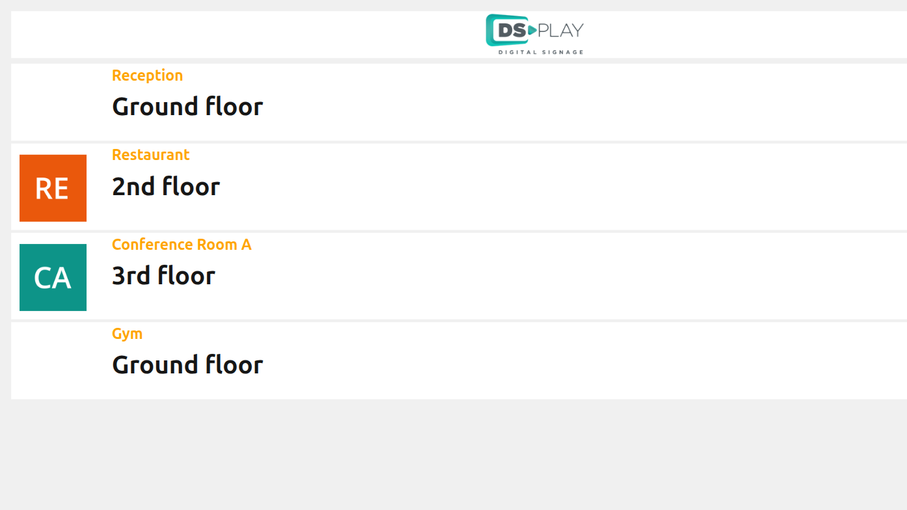
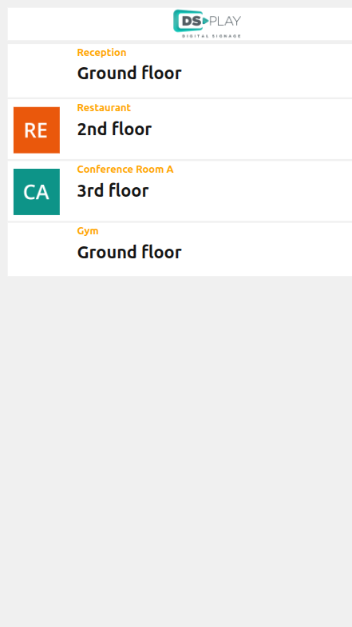
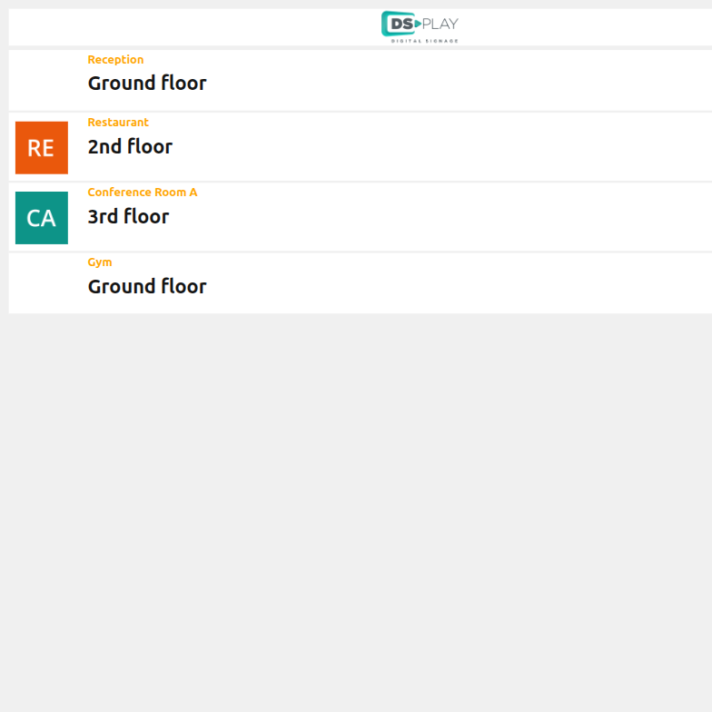

# DSPLAY - Building Directions Board Template

A [React](https://reactjs.org/) [HTML-based template](https://developers.dsplay.tv/docs/html-templates) for the [DSPLAY - Digital Signage](https://dsplay.tv/) platform — a directory board showing directions to destinations within a building (hotels, hospitals, offices, etc), paginated automatically to fit the screen.

> Built with [Vite](https://vitejs.dev/), requires Node.js 22.22.2+, 24.15.0+, or 26+ (see `.nvmrc`).

## Supported screen formats

| Landscape | Portrait | Square |
|-----------|----------|--------|
|  |  |  |

## Template variables

This template has no configurable Template Vars — it's driven entirely by `media.targets` (see below).

## Expected media data (`media.targets`)

Unlike a generic custom template, the list of destinations comes from `media` (see `src/components/app/index.jsx`), not from Template Vars:

```jsonc
{
  "logo": "",             // optional, falls back to the DSPLAY logo
  "duration": 30000,       // total display duration in ms, split evenly across pages
  "maxPageDurationSeconds": 60, // optional cap on how long a single page can show
  "targets": [
    {
      "name": "Reception",
      "place": "Floor 1",
      "floor": "Ground floor",
      "direction": "down_left", // up, up_right, right, down_right, down, down_left, left, up_left
      "logo": ""                // optional per-destination image
    }
  ]
}
```

Destinations are paginated automatically based on the screen's height (3 to 9 per page).

## Local development

```sh
npm install
npm start
```

`public/dsplay-data.js` defines `dsplay_config`/`dsplay_media` mock globals used only when the template isn't running inside the actual DSPLAY app (no `dsplay_template` is needed — this template has no Template Vars). Edit it to try out different destinations — the DSPLAY Player App replaces it with real content at runtime.

## Packing (release build)

```sh
npm run zip
```

This builds the template with Vite, which also generates `template-variables.json` + `template-example-data.json` (via [@dsplay/template-manifest](https://www.npmjs.com/package/@dsplay/template-manifest)'s Vite plugin) — the DSPLAY CMS reads these two files to auto-detect this template's variables and seed default preview values. It then generates `template.zip`, ready to be deployed to the [DSPLAY Web Manager](https://manager.dsplay.tv/template/create).

## Test assets

To use test assets (images, videos, etc) during development, put them in the `public/test-assets` folder and reference them in `dsplay-data.js` using their relative path. `public/test-assets` is automatically excluded from the release build.

## Maintaining dependencies

Regular npm dependencies, not vendored files:

```sh
npm outdated
npm update
```

For a version outside the declared range (typically a major bump), apply it deliberately and verify `npm start`, `npm run build`, and `npm test` still work before committing.

### Commit conventions

See [AGENTS.md](AGENTS.md).

## More

To see more about DSPLAY HTML Templates, visit: https://developers.dsplay.tv/docs/html-templates
